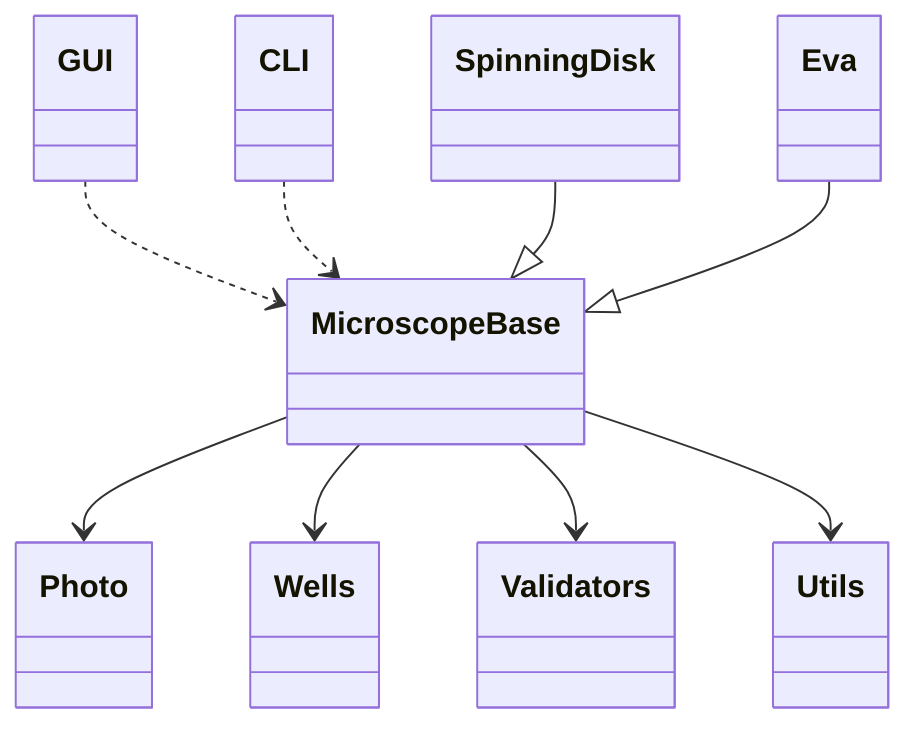

# Code Architecture

This document outlines the high-level architecture of the `photo_reader` application.

## High-Level Component Diagram

## Description

- **Entry Points**: 
  - `window.py`: Provides the Graphical User Interface (GUI).
  - `split_to_wells.py`: Provides the Command Line Interface (CLI).
- **Core Logic**:
  - `photo/microscopebase.py`: Defines the `MicroscopeBase` abstract base class, which orchestrates the splitting and moving logic.
  - `photo/spinning_disk.py` & `photo/eva.py`: Concrete implementations of `MicroscopeBase` for specific microscope output formats.
## Support Modules
  - `photo/photo.py`: Represents individual images and handles file copying/renaming.
  - `photo/wells.py`: Defines well positioning and naming conventions.
  - `photo/validators.py`: Provides utilities for validating file and directory paths.
  - `photo/utils.py`: Miscellaneous utility functions.

## Asset Bundling

The application bundles static assets (icons) into the executable using PyInstaller. 
- **Bundling**: Assets in the `icons/` directory are bundled during the CI/CD build process using the `--add-data` flag.
- **Runtime Access**: The `get_resource_path` function in `window.py` dynamically resolves the location of these assets. When bundled into a single-file executable, assets are unpacked into a temporary directory (`sys._MEIPASS`), which the function detects and uses as the base path. In development environments, it defaults to the current working directory.

